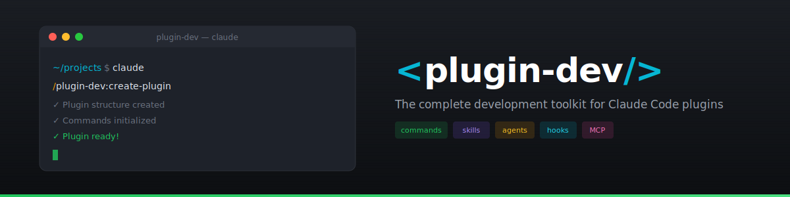
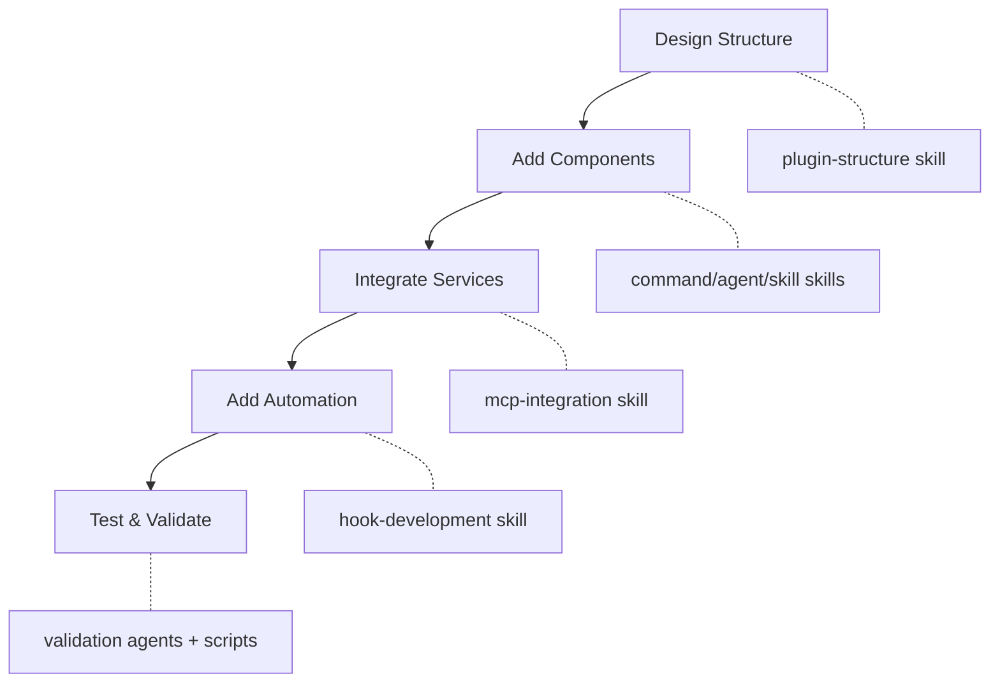

<p align="center">
  
</p>

# Plugin Development Toolkit

[](https://github.com/sjnims/plugin-dev/actions/workflows/component-validation.yml)
[](https://github.com/sjnims/plugin-dev/actions/workflows/markdownlint.yml)
[](https://github.com/sjnims/plugin-dev/releases)
[](LICENSE)

A comprehensive toolkit for developing Claude Code plugins with expert guidance on hooks, MCP integration, plugin structure, and marketplace publishing.

## Table of Contents

- [Overview](#overview)
- [Prerequisites](#prerequisites)
- [Installation](#installation)
- [Quick Start](#quick-start)
- [Skills](#skills)
- [Guided Workflows](#guided-workflows)
- [Validation Agents](#validation-agents)
- [Utility Scripts](#utility-scripts)
- [Development Workflow](#development-workflow)
- [Use Cases](#use-cases)
- [Best Practices](#best-practices)
- [Contributing](#contributing)
- [Getting Help](#getting-help)
- [Attribution](#attribution)
- [Changelog](#changelog)
- [License](#license)

## Overview

The plugin-dev toolkit provides **8 specialized skills**, **3 validation agents**, and **2 guided workflow commands** to help you build high-quality Claude Code plugins:

- **Skills** provide domain expertise loaded on-demand via trigger phrases
- **Agents** automate validation and generation tasks
- **Workflows** guide you through complete plugin or marketplace creation

Each component follows progressive disclosure: lean core documentation with detailed references and working examples available when needed.

## Prerequisites

- [Claude Code CLI](https://docs.anthropic.com/en/docs/claude-code) installed and configured
- Bash shell (for utility scripts)
- Git (for version control and marketplace publishing)

## Installation

Add this marketplace and install the plugin:

```bash
/plugin marketplace add sjnims/plugin-dev
/plugin install plugin-dev@sjnims/plugin-dev
```

Or for development, use directly:

```bash
claude --plugin-dir /path/to/plugin-dev/plugins/plugin-dev
```

## Quick Start

### Creating Your First Plugin

1. **Plan your plugin structure:**
   - Ask: "What's the best directory structure for a plugin with commands and MCP integration?"
   - The plugin-structure skill will guide you

2. **Add MCP integration (if needed):**
   - Ask: "How do I add an MCP server for database access?"
   - The mcp-integration skill provides examples and patterns

3. **Implement hooks (if needed):**
   - Ask: "Create a PreToolUse hook that validates file writes"
   - The hook-development skill gives working examples and utilities

Or use the guided workflow:

```bash
/plugin-dev:create-plugin A plugin for managing database migrations
```

## Skills

Skills load automatically when you ask relevant questions. Each skill includes core documentation, reference guides, working examples, and utility scripts.

| Skill | Trigger Phrases | Use For |
|-------|-----------------|---------|
| **Hook Development** | `create a hook`, `PreToolUse hook`, `validate tool use`, `prompt-based hooks`, `block dangerous commands` | Event-driven automation, operation validation, policy enforcement |
| **MCP Integration** | `add MCP server`, `integrate MCP`, `.mcp.json`, `Model Context Protocol`, `stdio/SSE server` | External service integration, API connections, database access |
| **Plugin Structure** | `plugin structure`, `plugin.json`, `auto-discovery`, `component organization` | Starting new plugins, organizing components, manifest configuration |
| **Plugin Settings** | `plugin settings`, `.local.md files`, `YAML frontmatter`, `per-project settings` | Configuration storage, user preferences, per-project state |
| **Command Development** | `create a slash command`, `command frontmatter`, `command arguments` | Slash commands, argument handling, command organization |
| **Agent Development** | `create an agent`, `write a subagent`, `agent frontmatter`, `autonomous agent` | Autonomous agents, AI-assisted generation, agent behavior |
| **Skill Development** | `create a skill`, `add a skill`, `skill description`, `progressive disclosure` | Creating new skills, improving skill quality |
| **Marketplace Structure** | `create a marketplace`, `marketplace.json`, `distribute plugins`, `host plugins` | Marketplace creation, plugin distribution, team sharing |

### Skill Resources

Each skill provides:

- **Core SKILL.md** (~1,500-2,000 words) - Essential API reference
- **references/** - Detailed guides and patterns
- **examples/** - Complete working code for copy-paste
- **scripts/** - Validation and testing utilities

For detailed documentation on any skill, ask Claude Code or browse the `skills/` directory.

## Guided Workflows

### /plugin-dev:create-plugin

A comprehensive, end-to-end workflow for creating plugins from scratch.

**8-Phase Process:**

1. **Discovery** - Understand plugin purpose and requirements
2. **Component Planning** - Determine needed skills, commands, agents, hooks, MCP
3. **Detailed Design** - Specify each component and resolve ambiguities
4. **Structure Creation** - Set up directories and manifest
5. **Component Implementation** - Create each component using AI-assisted agents
6. **Validation** - Run plugin-validator and component-specific checks
7. **Testing** - Verify plugin works in Claude Code
8. **Documentation** - Finalize README and prepare for distribution

**Usage:**

```bash
/plugin-dev:create-plugin [optional description]

# Examples:
/plugin-dev:create-plugin
/plugin-dev:create-plugin A plugin for managing database migrations
```

### /plugin-dev:create-marketplace

A guided workflow for creating plugin marketplaces to distribute plugins.

**8-Phase Process:**

1. **Discovery** - Understand marketplace purpose and audience
2. **Plugin Planning** - Determine plugins to include
3. **Metadata Design** - Configure marketplace metadata and branding
4. **Structure Creation** - Create directory and manifest
5. **Plugin Entry Configuration** - Configure each plugin entry (paths, repos, versions)
6. **Distribution Setup** - Configure team settings or community guidelines
7. **Validation** - Run marketplace validators
8. **Testing & Finalization** - Test installation and finalize

**Usage:**

```bash
/plugin-dev:create-marketplace [optional description]

# Examples:
/plugin-dev:create-marketplace
/plugin-dev:create-marketplace A marketplace for our team's internal tools
```

## Validation Agents

Use these agents proactively after creating components:

| Agent | Purpose | Trigger |
|-------|---------|---------|
| **plugin-validator** | Validates entire plugin structure, manifest, and marketplace.json | "validate my plugin", "check plugin structure" |
| **skill-reviewer** | Reviews skill quality, triggering reliability, and best practices | "review my skill", "check skill quality" |
| **agent-creator** | Generates new agents from natural language descriptions | "create an agent", "generate an agent that..." |

**Example usage:**

```
> validate my plugin at plugins/my-plugin
> review the skill I just created
> create an agent that reviews code for security issues
```

## Utility Scripts

All scripts are located in `plugins/plugin-dev/skills/*/scripts/` and can be run directly:

### Agent Development

```bash
# Create a new agent skeleton
./skills/agent-development/scripts/create-agent-skeleton.sh my-agent agents/

# Validate agent frontmatter and structure
./skills/agent-development/scripts/validate-agent.sh agents/my-agent.md

# Test agent trigger phrases
./skills/agent-development/scripts/test-agent-trigger.sh agents/my-agent.md
```

### Command Development

```bash
# Validate command structure
./skills/command-development/scripts/validate-command.sh commands/my-command.md

# Check frontmatter fields
./skills/command-development/scripts/check-frontmatter.sh commands/my-command.md
```

### Hook Development

```bash
# Validate hooks.json schema
./skills/hook-development/scripts/validate-hook-schema.sh hooks/hooks.json

# Test a hook with sample input
./skills/hook-development/scripts/test-hook.sh hooks/my-hook.sh input.json

# Lint hook scripts
./skills/hook-development/scripts/hook-linter.sh hooks/my-hook.sh
```

### Plugin Settings

```bash
# Validate settings file structure
./skills/plugin-settings/scripts/validate-settings.sh .claude/plugin.local.md

# Parse frontmatter from settings
./skills/plugin-settings/scripts/parse-frontmatter.sh .claude/plugin.local.md
```

## Development Workflow



| Phase | Skill/Tool | What You Do |
|-------|------------|-------------|
| **Design** | plugin-structure | Define manifest, directory layout |
| **Components** | command/agent/skill development | Create commands, agents, skills |
| **Services** | mcp-integration | Configure MCP servers |
| **Automation** | hook-development | Add hooks for validation/automation |
| **Validate** | Agents + scripts | Run validators, test components |

## Use Cases

### Building a Database Plugin

| Step | Ask Claude Code | Skill Used |
|------|-----------------|------------|
| 1 | "What's the structure for a plugin with MCP integration?" | plugin-structure |
| 2 | "Configure an stdio MCP server for PostgreSQL" | mcp-integration |
| 3 | "Add a Stop hook to ensure connections close properly" | hook-development |

### Creating a Validation Plugin

| Step | Ask Claude Code | Skill Used |
|------|-----------------|------------|
| 1 | "Create hooks that validate all file writes for security" | hook-development |
| 2 | "Test my hooks before deploying" | Use validate-hook-schema.sh |
| 3 | "Organize my hooks and configuration files" | plugin-structure |

### Integrating External Services

| Step | Ask Claude Code | Skill Used |
|------|-----------------|------------|
| 1 | "Add Asana MCP server with OAuth" | mcp-integration |
| 2 | "Use Asana tools in my commands" | mcp-integration |
| 3 | "Structure my plugin with commands and MCP" | plugin-structure |

## Best Practices

### Security First

- Input validation in all hooks
- HTTPS/WSS for MCP servers
- Environment variables for credentials
- Principle of least privilege

### Portability

- Use `${CLAUDE_PLUGIN_ROOT}` for all paths
- Relative paths only within plugin
- Environment variable substitution for secrets

### Testing

- Validate configurations before deployment
- Test hooks with sample inputs
- Use debug mode (`claude --debug`)

### Documentation

- Clear README files for each plugin
- Document all environment variables
- Include usage examples

## Contributing

To contribute improvements:

1. Fork this repository
2. Make changes to `plugins/plugin-dev/`
3. Test locally with `claude --plugin-dir plugins/plugin-dev`
4. Run linters: `markdownlint '**/*.md'` and `shellcheck plugins/plugin-dev/skills/*/scripts/*.sh`
5. Create a PR with your changes

## Getting Help

- **Issues**: [GitHub Issues](https://github.com/sjnims/plugin-dev/issues)
- **Documentation**: [Claude Code Plugins](https://docs.anthropic.com/en/docs/claude-code/plugins)
- **Skills Reference**: [Claude Code Skills](https://docs.anthropic.com/en/docs/claude-code/skills)

## Attribution

This plugin was originally developed by [Daisy Hollman](mailto:daisy@anthropic.com) at Anthropic. The original plugin can be found at:

- [claude-code/plugins/plugin-dev](https://github.com/anthropics/claude-code/tree/main/plugins/plugin-dev)
- [claude-plugins-official/plugins/plugin-dev](https://github.com/anthropics/claude-plugins-official/tree/main/plugins/plugin-dev)

This repository ([sjnims/plugin-dev](https://github.com/sjnims/plugin-dev)) is an expanded version with:

- Enhanced skill descriptions with stronger trigger phrases
- Additional utility scripts (test-agent-trigger.sh, create-agent-skeleton.sh)
- Expanded MCP integration documentation
- Comprehensive command development references
- CI/CD workflows for validation and quality assurance
- Improved cross-references between skills

## Changelog

See [CHANGELOG.md](CHANGELOG.md) for release history and version details.

## License

MIT License - See [LICENSE](LICENSE) for details
